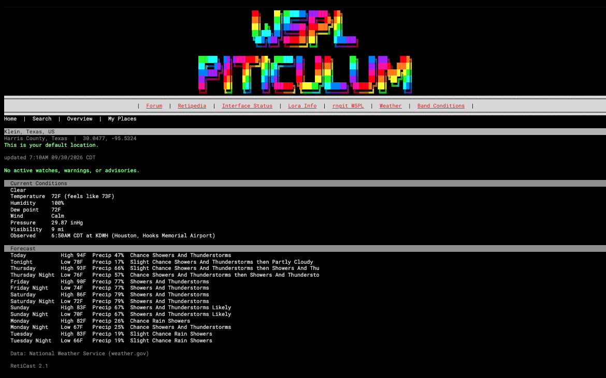
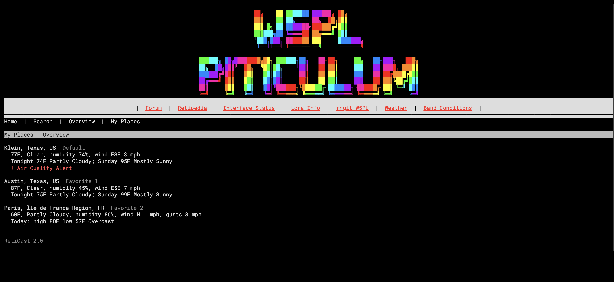
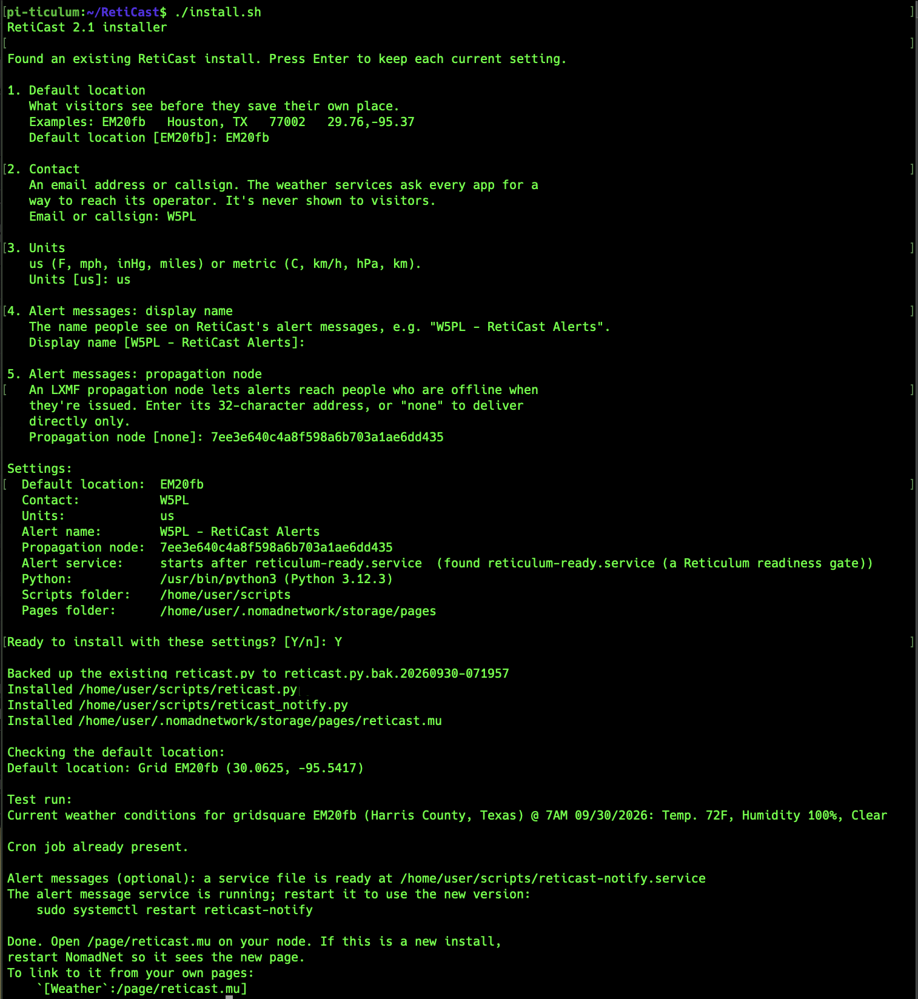
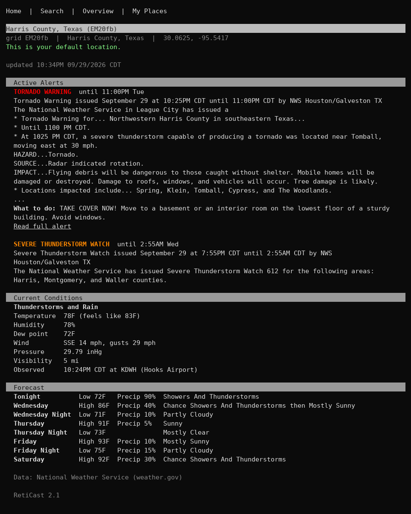
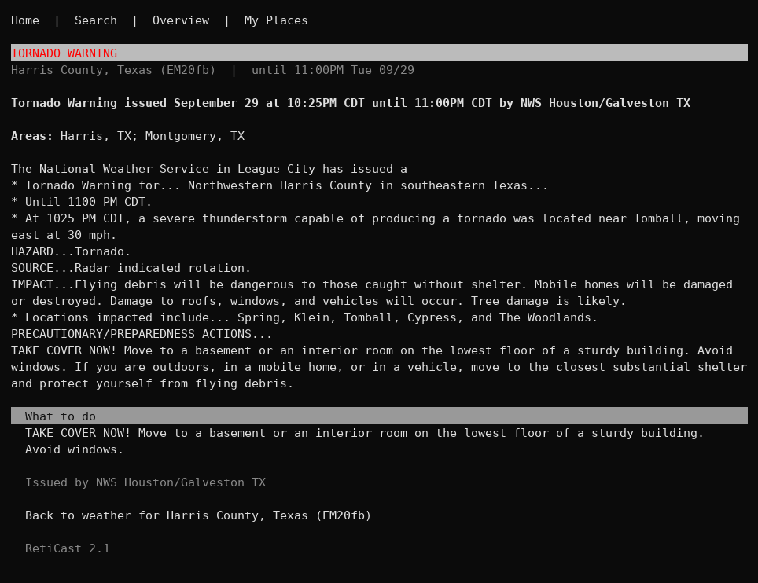
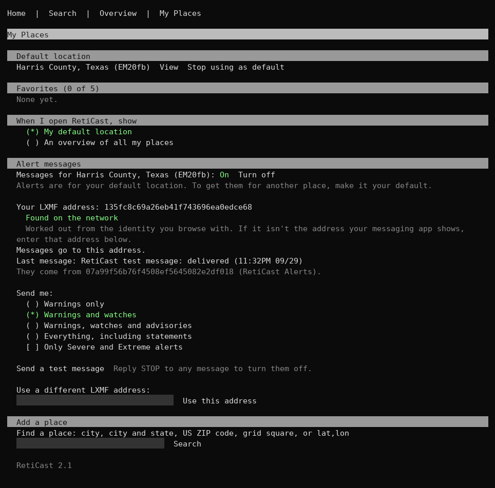
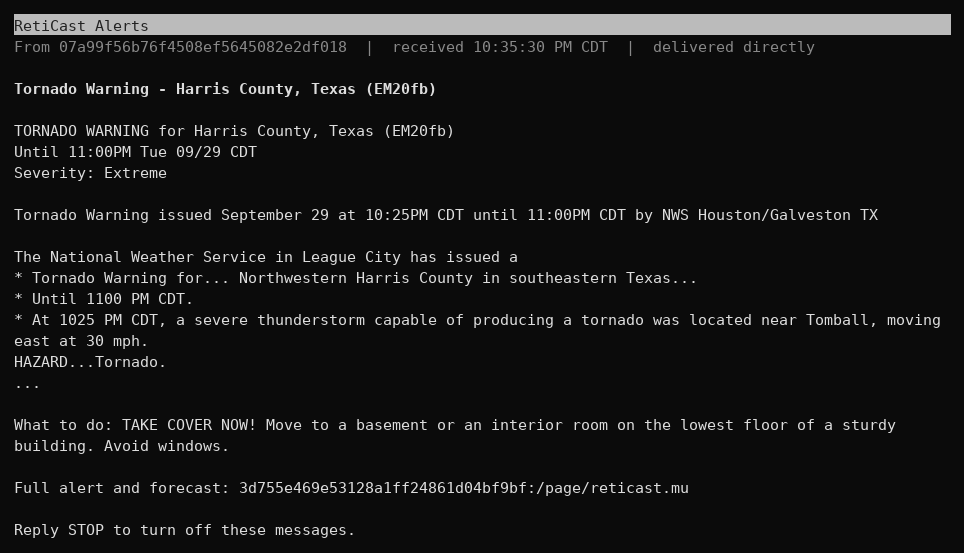

# RetiCast 2.1

Live weather for your NomadNet node, for any place in the world.

Visitors can look up the weather anywhere by city, city and state, US ZIP code, grid square, or latitude/longitude. Visitors who identify to your node can save a default location and up to 5 favorites. They can also choose whether RetiCast opens on their default location or on an overview of all their saved places, and can get an LXMF message whenever the National Weather Service issues an alert for their default location. Everyone else sees the default location you choose for your node.

US locations get active watches, warnings, and advisories, current conditions, and a 7-day forecast from the National Weather Service. Places outside the US get current conditions and a 7-day forecast from Open-Meteo. No API keys are needed, and RetiCast uses only the Python standard library.

## Screenshots

The weather page for a visitor's default location, with current conditions and the 7-day forecast:



The overview, which shows a short summary for each saved place:



My Places, where visitors manage their default location and favorites, and choose what RetiCast opens on:


These screenshots, and the installer screenshot under [Quick install](#quick-install), are from the W5PL Piticulum node. The banner and menu at the top come from that node's own site header, which RetiCast shows automatically (see [Using your site header](#using-your-site-header)).

The storm, alert and alert message screenshots further down come from a test run on a simulated Reticulum network ([Reticulated](https://github.com/RFnexus/reticulated)), using real Reticulum, LXMF and NomadNet with made-up test alerts. They were drawn with NomadNet's own page renderer, so they have no site header.

## Features

- **Search anywhere:** by city (`Paris`), city and state (`Austin TX` or `Paris, Texas`), US ZIP code (`77002` or `77002-1234`), Maidenhead grid square (`EM20fb`), or latitude/longitude (`29.76,-95.37`).
- **Saved places for identified visitors:** one default location plus up to 5 favorites, remembered by the node.
- **Choice of landing page:** each visitor chooses whether RetiCast opens on their default location or on an overview of all their saved places.
- **Server default:** guests, and visitors who haven't saved a default, see the location you choose.
- **Alerts (US):** every active watch, warning, and advisory, color coded (warnings red, watches orange, advisories yellow). Long alerts are trimmed, with a "Read full alert" link to the complete text.
- **Current conditions:** temperature, feels like, humidity, dew point, wind and gusts, pressure, visibility, and the reporting station.
- **7-day forecast:** day and night periods for US locations, and daily highs and lows elsewhere.
- **Fast pages:** a cron job keeps the node's default and visitors' saved places up to date, so those pages load from saved data. If a weather service stops answering, RetiCast shows the last saved data and says so.
- **Alert messages (optional, US):** visitors can turn on LXMF messages for alerts at their default location, choose which kinds they get, and turn them off by replying STOP. See [Alert messages](#alert-messages).
- **One-line summary:** a function you can use to put the current weather on your home page or any other page.
- **US or metric units.**

## Requirements

- A NomadNet node, with RetiCast installed as the same user that runs NomadNet
- Python 3.9 or newer (Raspberry Pi OS and current Linux distributions already have it)
- Internet access from the node, for the weather services
- `cron`, to keep the saved data fresh
- For the optional alert messages: the `rns` and `lxmf` Python packages (installed with NomadNet), and `systemd` or another way to run a background service

## Install options

There are two ways to install RetiCast. Both give the same result:

- **Quick install:** run `install.sh`, which asks a few questions and does everything for you. This is best for most people.
- **Manual install:** copy the files and set things up by hand. Use this if you want to see every step, or if your setup is unusual.

Either way, install as the same user that runs NomadNet. RetiCast doesn't need `sudo`.

## Quick install

```
git clone https://github.com/jwheeler188/reticast.git
cd reticast
./install.sh
```

The installer walks you through five settings, one at a time. Each one is explained, and you can press Enter to accept the value shown in brackets:

1. **Default location:** what visitors see before they save their own. Any search RetiCast accepts works, for example `EM20fb`, `Houston, TX`, `77002`, or `29.76,-95.37`.
2. **Contact:** an email address or callsign. The National Weather Service asks every app to identify itself with a way to reach its operator. It's sent to the weather services only, and isn't shown to visitors.
3. **Units:** `us` (F, mph, inHg, miles) or `metric` (C, km/h, hPa, km).
4. **Alert messages display name:** the name people see on alert messages, such as `W5PL - RetiCast Alerts`.
5. **Alert messages propagation node:** an LXMF propagation node, so alerts reach people who are offline when they're issued, or `none`. See [Reaching people who are offline](#reaching-people-who-are-offline).

It then shows all the settings together and asks whether to go ahead. Here is an upgrade on the W5PL Piticulum node, keeping most settings and adding a propagation node:



After you confirm, it:

- installs `reticast.py` and `reticast_notify.py` in `~/scripts`, and the page in your NomadNet pages folder
- looks up your default location and shows what it found
- does a test run
- adds a cron job that refreshes the weather every 5 minutes
- writes a ready-to-use service file for alert messages

If this is a new install, restart NomadNet so it sees the new page. Then open `/page/reticast.mu` on your node.

### Installer options

You can also give settings on the command line. When you do, the installer skips the walkthrough, shows every setting it will use (and where each came from: your option, your current setting, or the default), and asks before installing. Anything you don't give keeps its current setting, or the default on a new install.

```
./install.sh --location EM20fb --contact W1AW --display-name "W1AW - RetiCast Alerts"
```

| Option | Default | What it does |
| --- | --- | --- |
| `--location PLACE` | asks | The default location for visitors |
| `--contact EMAIL_OR_CALL` | asks | Your email or callsign, for the weather services |
| `--units us\|metric` | `us` | Units shown on the page |
| `--display-name NAME` | `RetiCast Alerts` | The name on alert messages |
| `--propagation-node HASH` | none | Propagation node for alert messages, or `none` |
| `--scripts-dir DIR` | `~/scripts` | Where the scripts and their data go |
| `--pages-dir DIR` | `~/.nomadnetwork/storage/pages` | Your NomadNet pages folder |
| `--python PATH` | output of `which python3` | The Python to use (3.9 or newer) |
| `--start-after UNIT` | detected | The systemd unit the alert service waits for, or `network`. See [Starting after Reticulum](#starting-after-reticulum) |
| `-s`, `--silent` | | Install without any questions |
| `-h`, `--help` | | Show all options |

Options can also be written as `--name=value`. The environment variables from earlier versions (`LOCATION`, `GRID`, `CONTACT`, `UNITS`, `DISPLAY_NAME`, `PROPAGATION_NODE`, `SCRIPTS_DIR`, `PAGES_DIR`, `PYTHON`) still work, and count as options.

### Silent install

`--silent` (or `-s`) installs without asking anything, which suits scripts and automated setups. It uses the options you give, and for everything else:

- **when upgrading**, your current settings, so a silent upgrade never resets anything
- **on a new install**, the built-in defaults. The installer warns if it had to use the default location (`EM20fb`) or has no contact, since you'll want to set those.

```
./install.sh --silent                                   # upgrade, keeping every setting
./install.sh -s --location 77002 --contact W1AW         # new install, no questions
```

A silent install stops with an error, rather than asking, if an option has a bad value or your pages folder can't be found.

It's safe to run the installer again, for example to change your default location. It backs up the previous scripts, keeps visitors' saved places, and doesn't add a second cron job.

### Changing or resetting settings

Run `./install.sh` with no options. It walks through every setting again, showing your current value in brackets: press Enter to keep it, or type a new value. To go back to a built-in default, type it in:

| Setting | Built-in default |
| --- | --- |
| Units | `us` |
| Alert messages display name | `RetiCast Alerts` |
| Propagation node | `none` |

The default location and contact have no useful built-in value, so enter your own. You can also change one setting at a time with an option, for example `./install.sh --propagation-node none`.

## Manual install

1. Copy `scripts/reticast.py` to `~/scripts/` and make it executable:

   ```
   mkdir -p ~/scripts
   cp scripts/reticast.py ~/scripts/
   chmod +x ~/scripts/reticast.py
   ```

2. Edit the settings at the top of `~/scripts/reticast.py`. At minimum, set `DEFAULT_LOCATION`, and put your email or callsign in `USER_AGENT`. See [Settings](#settings) for the rest.

3. Copy the page into your NomadNet pages folder:

   ```
   cp pages/reticast.mu ~/.nomadnetwork/storage/pages/
   chmod +x ~/.nomadnetwork/storage/pages/reticast.mu
   ```

4. Edit the first line of `reticast.mu` so it's the full path to your Python. Run `which python3` to find it, for example `#!/usr/bin/python3`. If `reticast.py` isn't in `~/scripts`, also change the `SCRIPTS_DIR` line.

5. Check your default location, then do a test run:

   ```
   ~/scripts/reticast.py --check
   ~/scripts/reticast.py --debug
   ```

6. Add the cron job with `crontab -e`, using your own paths:

   ```
   */5 * * * * /usr/bin/python3 /home/pi/scripts/reticast.py > /dev/null 2>&1
   ```

7. Restart NomadNet.

8. Optional, for alert messages: copy `scripts/reticast_notify.py` to `~/scripts/`, make it executable, set its first line to your Python, and set up the service as described in [Alert messages](#alert-messages).

## Upgrading from RetiCast 1.x

Run the installer. It reads your 1.x settings (`GRIDSQUARE`, your contact, and units) and offers them as the defaults, so pressing Enter at each question keeps them. `./install.sh --silent` keeps them without asking. The installer also:

- backs up your 1.x `reticast.py` as `reticast.py.bak.<date>`
- replaces the page with the 2.0 version
- removes the 1.x cache file, `reticast_cache.json`
- replaces the 1.x cron job instead of adding a second one

Things that stay the same:

- **Your home page.** `get_weather_string()`, `get_weather_title()`, and `get_weather_micron()` still exist and still describe your node's default location. A home page that shows the 1.x one-line summary keeps working unchanged.
- **Links.** The page is still `/page/reticast.mu`.

Things that change:

- `GRIDSQUARE` is now `DEFAULT_LOCATION`, and it accepts any location, not just a grid square.
- If you changed other settings in 1.x (such as `MAX_ALERT_CHARS`), they go back to their defaults. Your old copy is in the backup file if you want to reapply them.
- The page tells clients not to cache it, because it's now personal to each visitor.

## Using RetiCast

The menu at the top of the page has **Home** and **Search** for everyone, plus **Overview** and **My Places** for identified visitors.

### Searching

Type a place in the search box and select **Search**. Each result shows its name, country, and coordinates. Select a result to see its weather.

- **City and state:** a state narrows US results to that state. The comma is optional (`Paris TX`, `Paris, TX`, and `Paris, Texas` all work).
- **Other countries:** add the country to narrow the results, for example `Paris, France`.
- **Towns with the same name:** if two results in the same state would look identical, the county is added so you can tell them apart.
- **Grid squares and coordinates:** these don't need a lookup, so they work even if the place search service is unavailable.

### Saving places

To save places, a visitor needs to identify to your node in their NomadNet client first. RetiCast remembers their places by their identity, not by name or address, so they appear again on any client that uses the same identity.

On any place's weather page, and next to each search result, identified visitors can:

- **Make it their default.** Their default is what RetiCast opens on (unless they chose the overview). If the new default was a favorite, the two swap places. If it wasn't, the old default moves into their favorites if there's room.
- **Add it to their favorites,** up to 5.

### My Places

My Places shows a visitor's default and favorites. From there they can:

- view any saved place
- make a favorite their default
- remove a favorite
- stop using a place as their default
- choose what RetiCast opens on: their default location, or an overview of all their places (used once they have at least 2 saved places)

### Overview

The overview shows each saved place with its current temperature, conditions, humidity and wind, a short look ahead, and the names of any active alerts. Select a place's name for its full weather page.

### Alerts

For US locations, the page lists every active watch, warning, and advisory. Long alerts are trimmed; select **Read full alert** to see the complete alert on its own page, with the affected areas, full instructions, and the issuing NWS office. If an alert expires before someone opens it, the page says it's no longer active.

A page during a storm, with a trimmed tornado warning and a watch:



The same tornado warning after selecting **Read full alert**:



Weather alerts aren't available for places outside the US.

## Alert messages

RetiCast can send visitors an LXMF message whenever the National Weather Service issues an alert for their default location. This part is optional: it's a separate background service, `reticast_notify.py`, and the weather page works the same without it.

### How visitors use it

In **My Places**, visitors with a US default location see an **Alert messages** section. Alerts are always for the visitor's default location; to get them for another place, they make it their default. In this section they can:

- turn messages on or off
- choose what they get: warnings only, warnings and watches (the default), warnings, watches and advisories, or everything including statements
- limit messages to Severe and Extreme alerts
- send themselves a test message
- send messages to a different LXMF address

They can also turn messages off by replying **STOP** to any alert message.



Each alert is sent once. Updates to an alert someone already got (such as an extended warning) aren't sent again, but an upgrade, such as a watch becoming a warning, is. Each message has the alert, when it ends, its headline, a short description, what to do, and a link to the full alert on your node. Messages are kept short for slow LoRa links.

A tornado warning as it arrived in a visitor's messaging app:



### Where messages go

Visitors don't need to type in an LXMF address. When someone identifies to your node, NomadNet tells RetiCast their identity, and their LXMF address is worked out from it. That's the same identity their messaging app uses in most setups.

The section shows that address and whether it has been **found on the network**. RetiCast can only send to an address once the visitor's messaging app has announced it. Until then the section says "Not found on the network yet", and RetiCast keeps asking the network for it. Opening the messaging app, so it announces itself, usually fixes this. The section also shows what happened to the visitor's last message: delivered, left at the propagation node, or waiting for the address to be found.

Some people use one identity for browsing and another for messaging. If the address shown isn't the one their messaging app shows, they can enter their app's address instead. RetiCast then sends a 6-digit code to that address, and they enter it on the page to confirm it's theirs. Without that step, anyone could send alerts to someone else's address.

### Setting it up

1. The service needs the `rns` and `lxmf` Python packages. If NomadNet runs on the same machine, you already have them.
2. Run the installer. It installs `reticast_notify.py` and writes a ready-to-use service file, `~/scripts/reticast-notify.service`, with your user name and paths filled in.
3. Install and start the service (this is the one step that needs `sudo`):

   ```
   sudo cp ~/scripts/reticast-notify.service /etc/systemd/system/
   sudo systemctl daemon-reload
   sudo systemctl enable --now reticast-notify
   ```

4. Check that it started with `journalctl -u reticast-notify -n 20`. Within a minute, the Alert messages section appears in My Places.

The service connects to Reticulum like any other program on the machine. If you run `rnsd` or NomadNet as a shared instance, it uses that.

### Starting after Reticulum

Programs that use Reticulum tend to fail if they start before Reticulum is ready, which is most noticeable after a reboot. So the installer looks at how Reticulum is started on your machine, and has the alert service wait for the same thing:

1. **A readiness gate.** If you use [reticulum-readygate](https://github.com/jwheeler188/reticulum-readygate), the alert service waits for `reticulum-ready.service`, just like NomadNet in that project's example.
2. **Whatever NomadNet waits for.** If NomadNet's own service waits for another Reticulum service, the alert service waits for that one too.
3. **The service that runs `rnsd`.** The alert service starts after it. It can still start before Reticulum is fully ready, so the installer suggests a readiness gate.
4. **Nothing found.** The alert service waits for the network only.

The installer shows what it found in its settings summary, and you can choose yourself with `--start-after`, for example `--start-after reticulum-ready.service`, or `--start-after network`.

If you use stack control scripts like reticulum-readygate's `reloadstack.sh`, `stopstack.sh` and `checkstack.sh`, the installer finds them and offers to add `reticast-notify.service` to their `DEPENDENTS` list, backing each one up first. (A silent install only lists them.) It looks in your home folder, one folder down (such as `~/reticulum-readygate/`), `~/bin`, `~/.local/bin`, `~/scripts` and `/usr/local/bin`.

### Which Python runs the alert service

The alert service needs the `rns` and `lxmf` packages. If Reticulum was installed with `pip --user`, pipx or a virtual environment, the system's `python3` may not be able to import them when systemd starts the service. When that's the case, the installer finds the Python that NomadNet or `rnsd` actually runs with (from their service files, or the first line of those programs) and uses it for the alert service. The settings summary shows it as "Alert Python". The weather page itself needs only Python's standard library, so it keeps using `--python` or `python3`.

When an alert service file is already installed and the new one is different, for example because it now waits for a readiness gate, the installer shows the commands to update it.

### Reaching people who are offline

Without a propagation node, messages can only reach people whose device is online at the time. To reach everyone, use an LXMF propagation node, ideally one that's always on, or on the same machine. Enter it when the installer asks, or give it as an option:

```
./install.sh --propagation-node <address>
```

Then restart the service with `sudo systemctl restart reticast-notify`. The installer remembers the setting when you run it again.

Messages are tried directly first, then through the propagation node. If someone's address hasn't been heard on the network yet, their message waits (up to 6 hours) while the service asks the network for it.

### Notifier settings

These are at the top of `reticast_notify.py`:

| Setting | Default | What it does |
| --- | --- | --- |
| `PROPAGATION_NODE` | `""` | LXMF propagation node for people who are offline (`""` = direct delivery only) |
| `DISPLAY_NAME` | `"RetiCast Alerts"` | The name people see on the messages |
| `NODE_ADDRESS` | `""` | Your node's address for the link in messages (`""` = read from NomadNet's identity) |
| `CHECK_MINUTES` | `3` | How often to check for new alerts |
| `ANNOUNCE_HOURS` | `6` | How often the service announces itself on the network |
| `MAX_WAIT_HOURS` | `6` | How long to keep trying to reach an address nobody has heard from |
| `MAX_PER_CHECK` | `5` | Most new alerts sent to one person per check; the rest follow on the next check |
| `MAX_DESCRIPTION_CHARS` | `300` | How much of the alert description goes in a message |

`TEST_COOLDOWN_MINUTES` in `reticast.py` (default `10`) limits how often each visitor can send a test or confirmation message.

## Adding the weather to your home page

`get_weather_string()` returns a one-line summary for your node's default location, for example:

```
Current weather conditions for gridsquare EM20fb (Harris County, Texas) @ 8PM 09/26/2026: Temp. 77F, Humidity 74%, Clear
```

Active watches and warnings are added to the end of the line when there are any.

To show it on a page, with the word "Weather" linking to the full weather page:

```python
#!/usr/bin/python3
import os, sys
sys.path.insert(0, os.path.expanduser("~/scripts"))
from reticast import get_weather_string

print("`F0ff`!`_`[Weather`:/page/reticast.mu]`_`!: `Fddd" + get_weather_string() + "`f")
```

The summary is read from saved data, so it doesn't slow your home page down. The cron job keeps it fresh.

Other functions you can use the same way:

- `get_weather_title()` returns a short title, such as `Harris County, Texas (EM20fb)`.
- `get_weather_micron()` returns the full weather view (alerts, conditions, and forecast) for your default location, as Micron.

### Using your site header

If `~/scripts/site_parts.py` exists and has a `print_top()` function, RetiCast calls it at the top of every page, so the weather page shows your node's usual banner and menu. If the file isn't there, RetiCast simply starts with its own menu.

## Settings

All settings are at the top of `reticast.py`. The installer sets the first three for you.

| Setting | Default | What it does |
| --- | --- | --- |
| `DEFAULT_LOCATION` | `"EM20fb"` | What guests see. Any search works: grid square, `"City, ST"`, ZIP code, or `"lat,lon"` |
| `USER_AGENT` | `"(RetiCast, you@example.com)"` | Identifies your node to the weather services; put your email or callsign in it |
| `UNITS` | `"us"` | `"us"` or `"metric"` |
| `DEFAULT_LOCATION_NAME` | `""` | A display name for the default location (`""` = automatic) |
| `PAGE_PATH` | `"/page/reticast.mu"` | The page's path on your node; change it if you rename the page |
| `MAX_FAVORITES` | `5` | Favorites per visitor, not counting their default |
| `MAX_USERS` | `1000` | Most visitors who can save places on your node |
| `SEARCH_RESULTS` | `8` | Most results shown for a search |
| `ALERT_KEYWORDS` | `("Warning", "Watch")` | Alert types included in the one-line summary. Add `"Advisory"` for those too |
| `MAX_ALERT_CHARS` | `600` | Trim long alerts on the page and add a "Read full alert" link (`0` = never trim) |
| `FORECAST_PERIODS` | `14` | NWS forecast periods shown (14 = 7 days, day and night) |
| `CACHE_MINUTES` | `10` | How long current conditions and alerts are reused before asking again |
| `FORECAST_CACHE_MINUTES` | `30` | How long a forecast is reused |
| `RETRY_MINUTES` | `2` | After a failed update, how long to wait before trying again |
| `PREFETCH_LIMIT` | `50` | Most places the cron job refreshes per run |
| `PRUNE_DAYS` | `7` | Saved data for places nobody has saved is deleted after this many days |
| `TIMESTAMP_SOURCE` | `"now"` | Time shown in the one-line summary: `"now"` (when fetched) or `"observation"` (when the station took its reading) |
| `TIME_FORMAT` | `"%I%p %m/%d/%Y"` | Time format in the one-line summary |
| `MAX_STATIONS` | `3` | Nearby NWS stations to try if the closest has no current reading |
| `HTTP_TIMEOUT` | `8` | Seconds to wait for each web request |

After changing `DEFAULT_LOCATION`, run `~/scripts/reticast.py --check` to confirm what it resolves to.

## Commands

```
~/scripts/reticast.py              refresh saved places and print the one-line summary (what cron runs)
~/scripts/reticast.py --check      look up DEFAULT_LOCATION and show what it resolved to
~/scripts/reticast.py --search Q   test a search, e.g. --search "Austin TX"
~/scripts/reticast.py --page       print the full weather view for the default location
~/scripts/reticast.py --debug      add web request timings (works with the other commands)
~/scripts/reticast_notify.py --address   show the address alert messages come from
```

## How it works

- **Weather:** US places (including Puerto Rico, Guam, and the other US territories) use the National Weather Service. For those, RetiCast looks up the county and the nearest stations once and saves them, then fetches current conditions, alerts, and the forecast. Everywhere else uses Open-Meteo.
- **Search:** US ZIP codes use Zippopotam.us. Place names use Open-Meteo's geocoding. Grid squares and coordinates are worked out locally. Searches are saved for 7 days.
- **Saved data:** current conditions and alerts are reused for 10 minutes, and forecasts for 30. Visiting a place nobody has looked at recently fetches it on the spot, which takes a few seconds.
- **Cron:** every 5 minutes, the cron job refreshes the node's default location and visitors' saved places, then cleans out old data. Only data that's out of date is fetched again.
- **Pages:** each visit runs `reticast.mu`, which builds the page for that visitor. NomadNet tells RetiCast who the visitor is when they've identified.

### Files

Everything RetiCast saves is in `~/scripts/reticast_data/`, which is private to the NomadNet user:

| File | What it holds |
| --- | --- |
| `users.json` | Each identified visitor's saved places and landing page choice |
| `server_default.json` | Your default location as it was looked up |
| `cache/` | Saved weather, location details, and search results |
| `notify/` | The alert message service's identity, which alerts each person has been sent, and messages waiting to be delivered |

You can delete `cache/` at any time; it's rebuilt as needed. Deleting `users.json` erases all visitors' saved places.

## Privacy

For visitors who save places, RetiCast stores their identity hash (the same public identifier NomadNet uses for them), their saved places, and their landing page choice. For visitors who use alert messages, it also stores their alert choices, any LXMF address they entered, and which alerts they've been sent. That's all. Nothing is stored for visitors who only look at the weather.

Place searches go to Open-Meteo or Zippopotam.us, and weather requests go to the National Weather Service or Open-Meteo. These requests come from your node, not the visitor, and don't include anything about the visitor.

## Troubleshooting

**The page shows "Weather data isn't available for this place right now."**
The weather service didn't answer. RetiCast tries again after `RETRY_MINUTES`. Run `~/scripts/reticast.py --debug` to see each request and how it went.

**"This node's default location couldn't be looked up right now."**
Run `~/scripts/reticast.py --check`. If the lookup fails, check the spelling of `DEFAULT_LOCATION` (adding a state or country helps), or use a grid square or coordinates, which don't need a lookup.

**The page shows "saved data - the weather service didn't answer."**
RetiCast is showing the last good data because an update failed. This usually clears up on its own. If it doesn't, check that the cron job is running with `crontab -l`, and that the node can reach the internet.

**The alert service fails with an import error under systemd, but runs fine by hand.**
systemd is starting it with a Python that can't import `rns` and `lxmf`. Check the first line of `~/scripts/reticast_notify.py` and the `ExecStart=` line of the service file: both should use the Python that NomadNet runs with. Running the installer again with `--python /path/to/that/python3` sets it.

**The alert service fails to start after a reboot.**
It probably started before Reticulum was ready. Run the installer again: it looks for a readiness gate and updates the service file to wait for it (then follow the commands it shows). If you don't have a gate yet, [reticulum-readygate](https://github.com/jwheeler188/reticulum-readygate) adds one.

**Visitors can't save places.**
They need to identify to your node in their client first. The page says "You're browsing as a guest" until they do.

**The Alert messages section doesn't appear in My Places.**
It only appears while the service is running, and only for identified visitors. Check the service with `systemctl status reticast-notify`. The section also explains when a visitor has no default location, or a default outside the US.

**A test message doesn't arrive.**
Check the Alert messages section in My Places. If the address says "Not found on the network yet", the visitor's messaging app hasn't announced it; opening the app usually fixes this, and waiting messages are then delivered. If the address shown isn't the one their messaging app shows, they browse with a different identity and can enter the app's address instead. "Last message" shows whether the test was delivered. `journalctl -u reticast-notify` shows each message as it's sent.

**A search finds nothing.**
Try adding a state or country (`Springfield, IL`), or use a ZIP code, grid square, or coordinates.

**The page doesn't load at all.**
Check that the first line of `reticast.mu` is the full path to Python, that both `reticast.mu` and `reticast.py` are executable, and that the `SCRIPTS_DIR` line in `reticast.mu` points at the folder containing `reticast.py`. Running the page directly, for example `~/.nomadnetwork/storage/pages/reticast.mu`, shows any error.

## Data sources and fair use

- [National Weather Service API](https://www.weather.gov/documentation/services-web-api): US weather and alerts
- [Open-Meteo](https://open-meteo.com): weather outside the US, and place search. Free for non-commercial use.
- [Zippopotam.us](https://zippopotam.us): US ZIP codes

Please keep your contact in `USER_AGENT` so the services can reach you if there's a problem, and keep the cache settings at or above their defaults.

## License

RetiCast is released into the public domain under the [Unlicense](LICENSE).

This software is possible because my parents believed in me and encouraged me to follow my passions.
